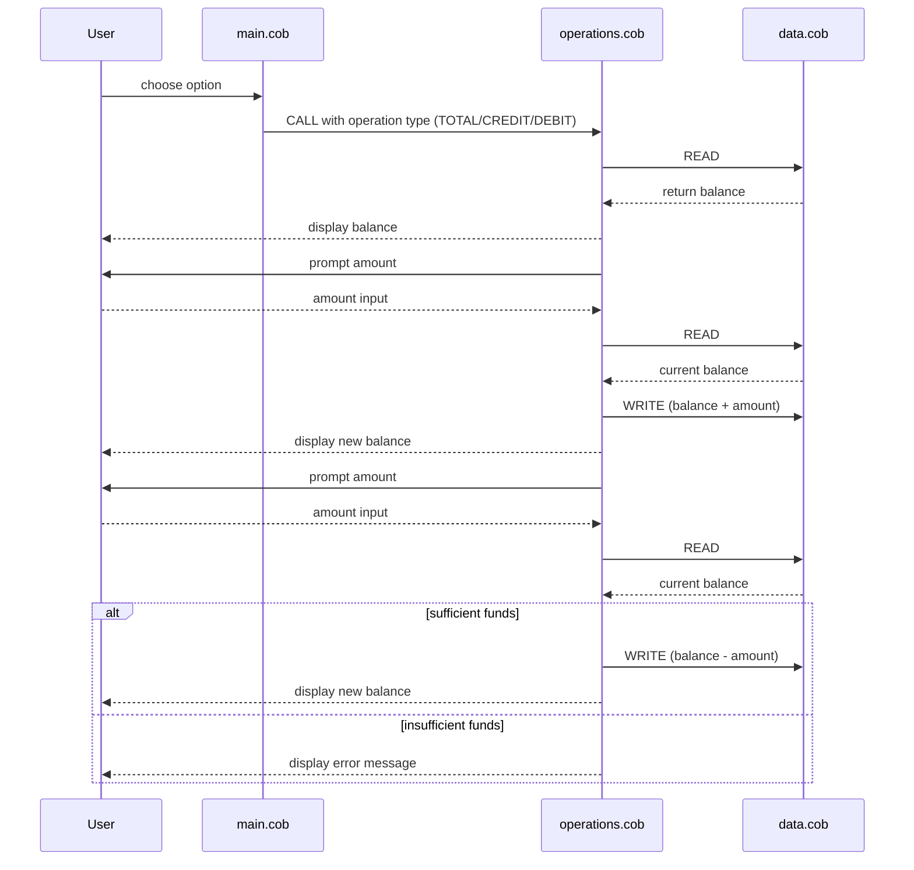

# Documentation for COBOL Account Management System

This repository contains a simple COBOL-based account management system.
The purpose of the files under `src/cobol` is described below along with their
key functions and any business rules related to student accounts.

## File Overview

### `main.cob`
- **Purpose:** Acts as the entry point for the application.
- **Key Functions:**
  - Presents a text menu to the user with options to view balance, credit,
    debit, or exit.
  - Accepts the user's choice and dispatches requests to the `Operations`
    program via `CALL` statements.
  - Maintains a loop (`PERFORM UNTIL`) to continue processing until the user
    chooses to exit.
- **Business Rules:**
  - Only accepts menu choices `1` through `4`; any other input triggers an
    "Invalid choice" message.

### `operations.cob`
- **Purpose:** Contains the business logic for account actions (viewing
  balance, crediting, debiting).
- **Key Functions:**
  - Interprets the operation requested by the caller (`OPERATION-TYPE`).
  - For a balance inquiry (`TOTAL`): retrieves the current balance via
    `DataProgram` and displays it.
  - For a credit operation (`CREDIT`): prompts for an amount, reads the
    existing balance, adds the amount, writes the updated balance back to
    storage, and displays the new total.
  - For a debit operation (`DEBIT`): prompts for an amount, reads balance,
    checks if sufficient funds exist, subtracts and writes back, or
    displays an insufficient funds message if not enough money is available.
- **Business Rules:**
  - Debits may only proceed when the account has an equal or greater balance
    than the requested amount.  If not, the transaction is denied with a
    user-visible warning.

### `data.cob`
- **Purpose:** Simulates persistent data storage for a single student account
  balance.
- **Key Functions:**
  - Maintains an in-memory `STORAGE-BALANCE` variable representing the
    account balance (initialized to `1000.00`).
  - Handles `READ` and `WRITE` operations received from `Operations`:
    - `READ` populates the passed-in balance field with the stored value.
    - `WRITE` updates the stored balance with the value passed by the
      caller.
- **Business Rules:**
  - Storage is simplistic and only reflects a single account balance; no
    concurrency or multiple accounts are supported.

## General Notes

- These programs are organized to separate user interaction (`main.cob`),
  business rules (`operations.cob`), and data handling (`data.cob`).
- The account balance is always treated as a numeric value with two decimal
  places (`PIC 9(6)V99`), ensuring money is handled consistently.
- No authentication, logging, or error recovery beyond simple checks is
  implemented; this is a minimal prototype intended for demonstration.

Feel free to expand or modernize these components as part of the
"modernize-legacy-code" efforts.

## Sequence Diagram of Data Flow

